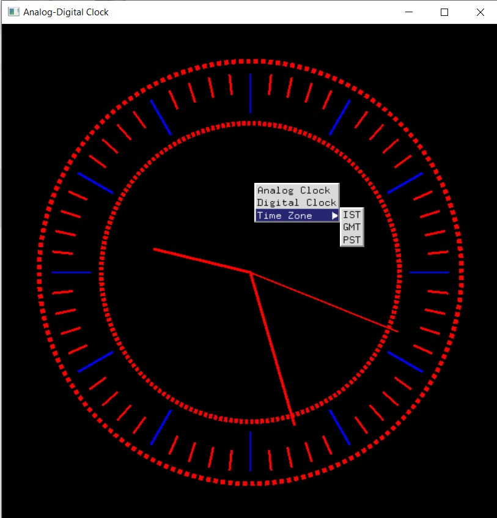
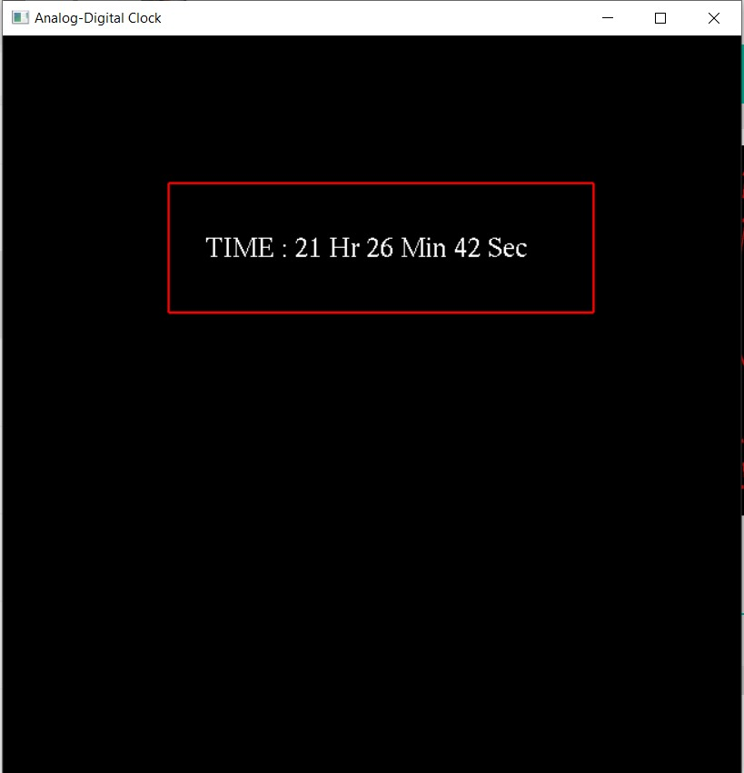

<h1>COMUTER GRAPHICS AND VISUALIZATION Mini Project Assignment</h1>


Developed By:

<h3> Swati &nbsp |&nbsp 1BY18CS175 </h3>

<h3> Tarush J Reddy &nbsp |&nbsp 1BY18CS177</h3>

<hr></hr>
<br/>

## Real-Time Clock
<br/>
<span>
&nbsp&nbsp&nbsp&nbsp&nbsp&nbsp

&nbsp&nbsp&nbsp&nbsp&nbsp&nbsp

&nbsp&nbsp&nbsp&nbsp&nbsp&nbsp

</span>

<br/>
<br/>


## Real-Time Clock
<br/>

A Computer Graphics and Visualisation Mini Project to display a "Real-Time Clock" in both analog and Digital version.
<br/>
<br/>

## Usage

#### Clone and build:

```zsh
git clone "git@github.com:tarushjreddy/CGV-Assignment-.git"
cd CG_MINI_PROJECT - CLOCK
codeblocks Clock.cbp

```
